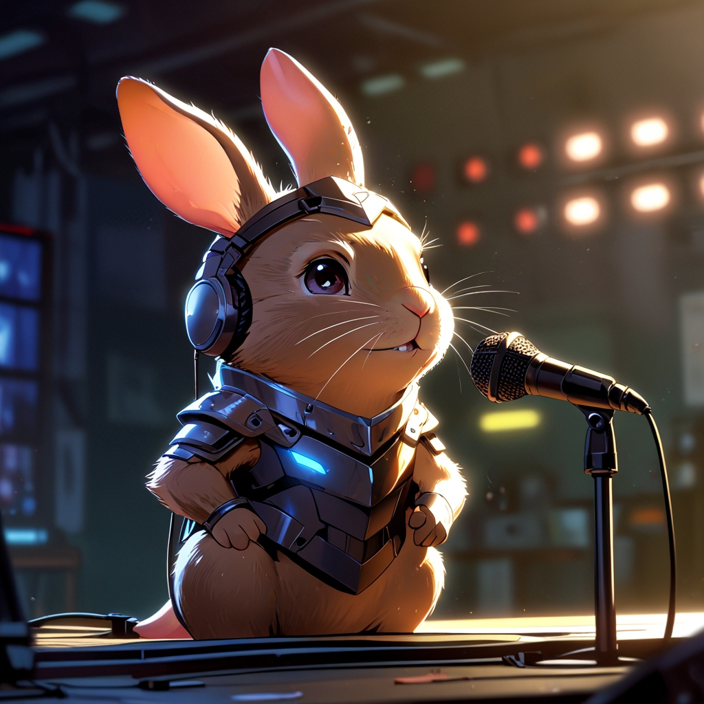

<a align="center" href="output/podcast_editado.mp3">
    acesse o podcast
</a>

    <audio src="output/podcast_editado.mp3" controls title="Podcast editado"></audio>

# Projeto Podcast Gerado por I.A.s

 > ℹ️ **NOTE:** Este é o repositório desenvolvido durante uma live no Youtube em parceria com a [DIO](https://dio.me)

Projeto com o objetivo de gerar um podcast utilizando ferramentas de IA através de prompts mais trabalhado.

## 💻 Tecnologias utilizadas no projeto

- [ChatGPT](https://chat.openai.com/) 
- [Leonardo.Ai](https://leonardo.ai/)
- [ElevenLabs](https://beta.elevenlabs.io/)
- [Capcut](https://www.capcut.com/pt-br/)

## ✨ Como foi feito ?

- Roteiro gerado via chatgpt
- Audio gerado pela elevenLabs
- Leonardo.Ai para gerar capas
- Capcut para tratar aúdio e adicionar sons de fundo

## 📚 Materiais

- Imagens utilizadas se encontram em `assets`
- Áudio gerado disponível em `output`

## 👨‍💻 Autora

Produzido por Taina Maia, com assistência de IA.
